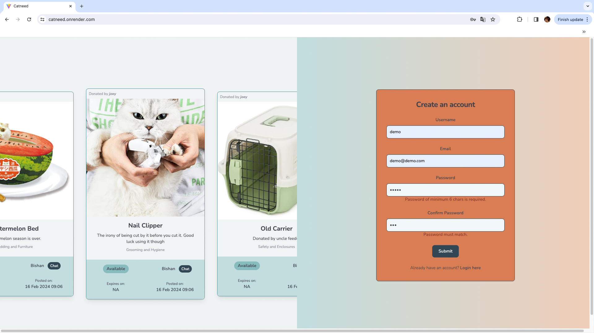
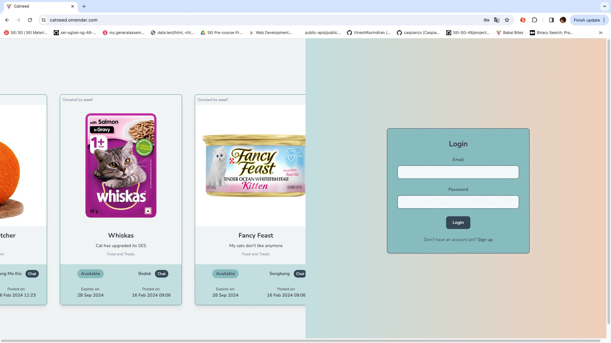
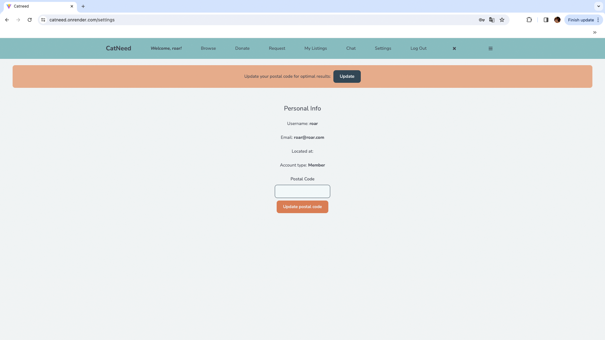
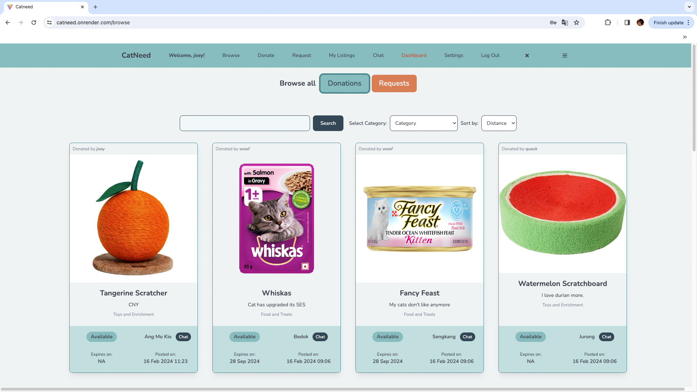
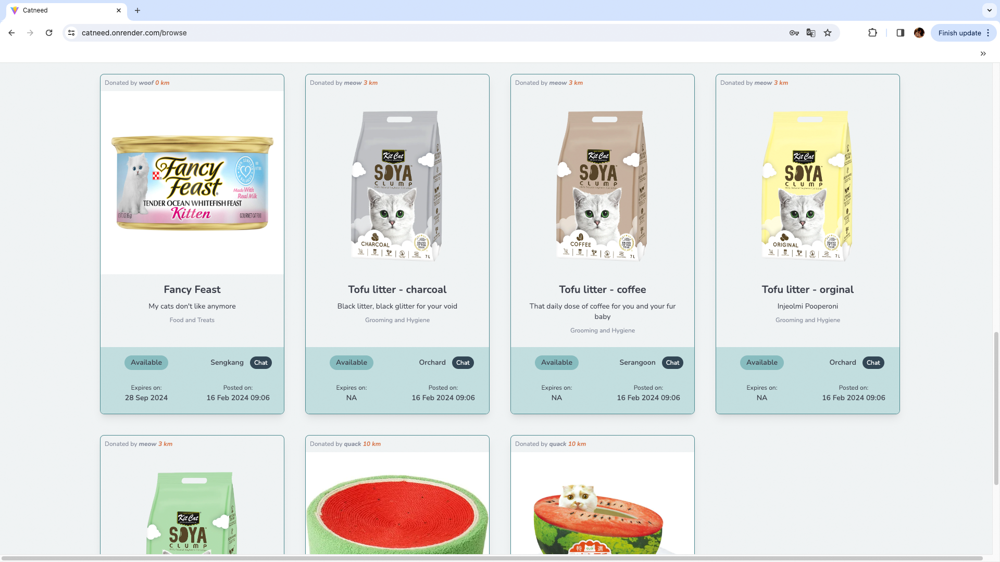
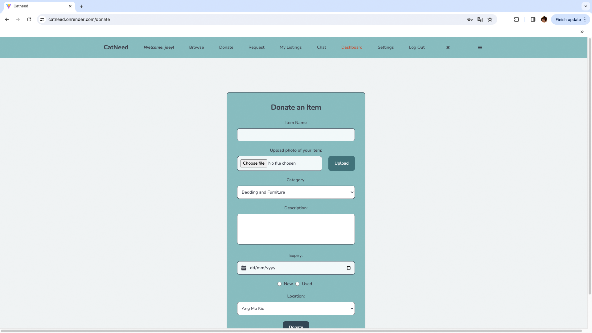
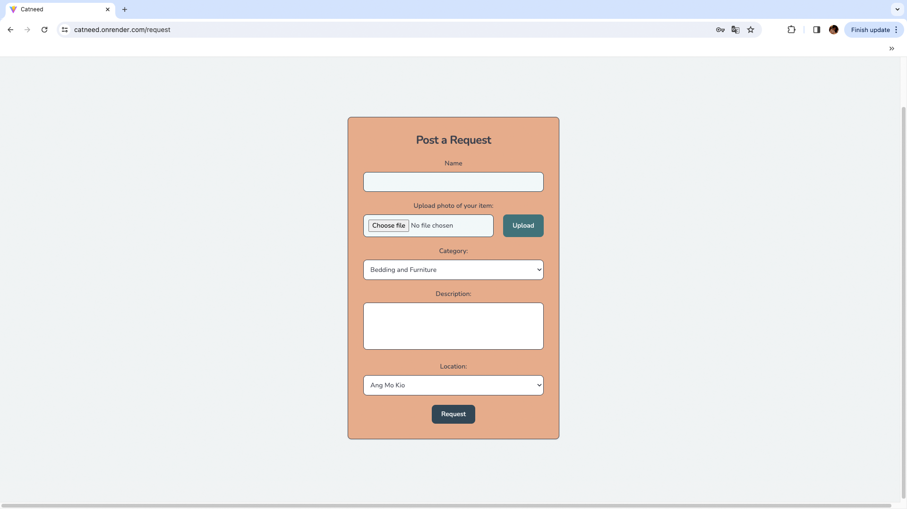
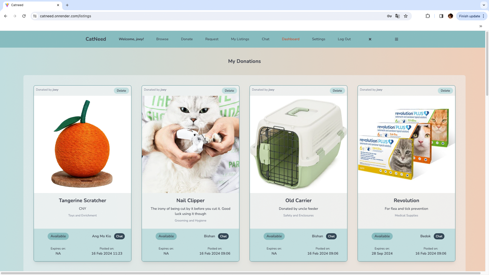
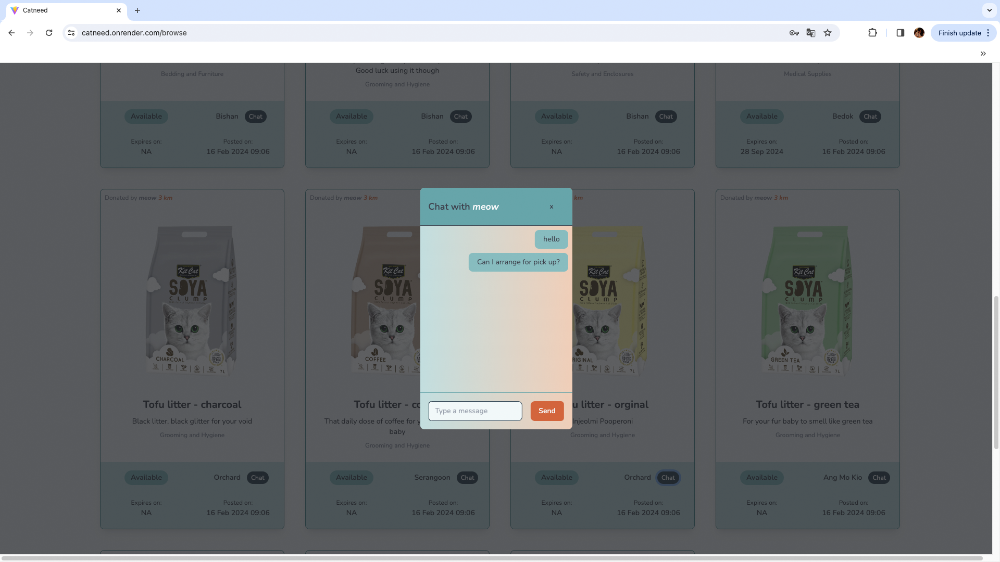
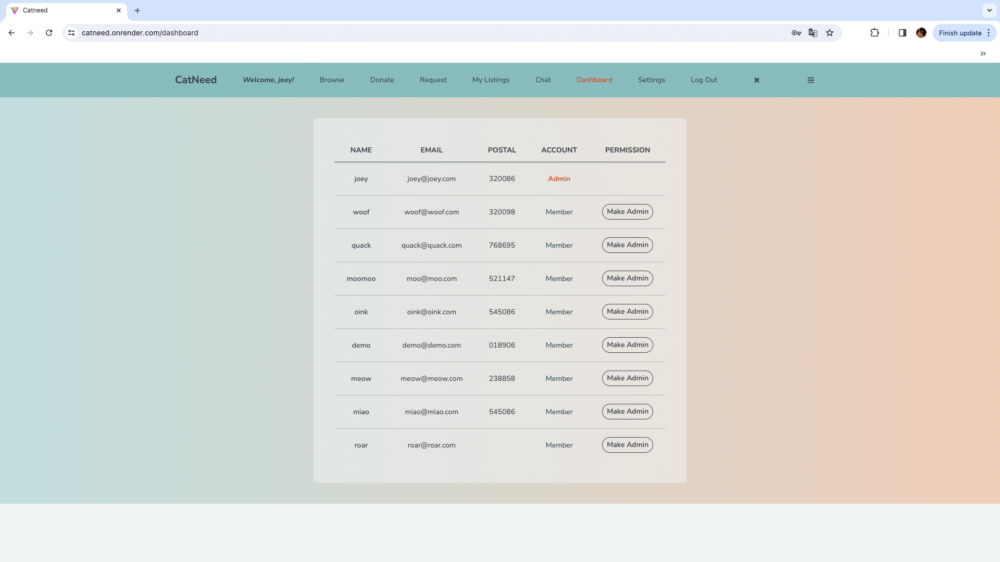

# Catneed

Catneed connects community cat rescuers/fosterers and cat owners to share essential like food, medical items, and carriers. By providing a space for these groups, resources are directed to where they are needed most, supporting the welfare of community cats.

## Features

**Sign up for an account:** Signup form consists of the necessary validations for valid inputs, minimum password length and confirm password watch ensures that both password fields have the same input. Password is hashed by bcrypt.

**Login to an account**: Logins authenticated with JSON Web Token. New users are notified to update their postal code for optimal search results.

**Browse donations or requests:** Cat rescuers can browse what is currently being donated, search item by name, filter by categories, and sort by proximity based on postal codes of donors.

**Post a request or donate an item:** Cat rescuers can post a request for an item that they require, while donors can post new or unused items that they no longer need.

**View listings:** Users can view and delete what they have previously requested or donated.

**Chat feature:** Users can chat to arrange for pickup of items.

**Admin:** Users of Admin tier can view all users on the platform and make them admin

